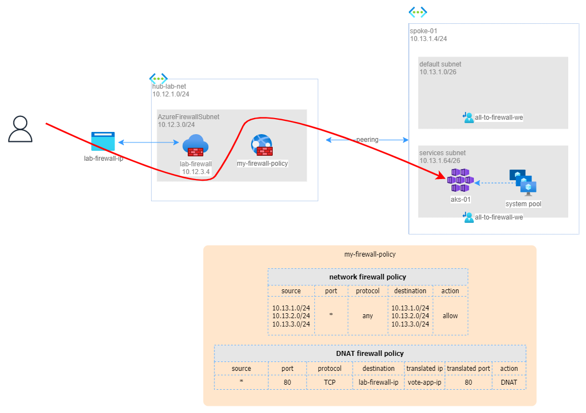

# SCENARIO: Expose a workload from AKS with Azure Firewall

## Pre-requisites

To implement this scenario, you need to install the `AKS-playground` that you find in the home of this repo.

## Solution
In the context of an hub-and-spoke network, in this scenario we will expose a workload from Azure Kubernetes Service (`azure-vote-front`) externally via the Azure Firewall located in the hub network.

It is recommended to expose internal services via an Azure Firewall because it provides a centralized and secure way to access them from outside the virtual network. Azure Firewall is a stateful firewall that can filter traffic based on rules and application signatures. It also supports network address translation (NAT) and threat intelligence-based filtering. By using Azure Firewall, you can protect your internal services from unauthorized or malicious access, while allowing authorized users to access them from the internet or other networks.

When you install Azure Firewall, it has one public IP. We will expose on this IP, on port 80 (HTTP), the internal service `azure-vote-front`.

In the context of our hub-and-spoke network, already all the traffic from and to any spoke is routed via the Azure Firewall. To expose the internal service on the Azure Firewall public IP, we need to create an additional DNAT Rule on the current firewall policy.

> DNAT stands for **Destination Network Address Ttranslation** and is used when an external Host with a Public IP, starts a connection towards our Internal/Private Network. Therefore, the DNAT L3 device (in our scenario Azure Firewall), transforms the public IP address of that host to the private IP of the internal Host/Server.

_Download the [draw.io file](../images/firewall-01.drawio) of this schema._

# Step 1 - get the Azure Firewall public IP Address
Go to Azure portal > Firewalls > `lab-firewall` > Firewall public IP > `lab-firewall-ip` > IP Address > IP (**x.x.x.x**)

# Step 2 - get the the IP of the front-end pod
Go to Azure Portal > `aks-01` > Workloads > `azure-vote-front` > pods > `azure-vote-front-##########-#####` > Pod IP (**y.y.y.y**) 

# Step 3 - configure Azure Firewall DNAT policy

Go to Azure Portal > `hub-firewall-policy` > DNAT Rules > Add Rule Collection
* Name: `my-dnat-rule-collection`
* Collection Type: `DNAT`
* priority: `1000`
* Collection Group: `DefaultDnatCollectionGroup`
* Source Type: `IP`
* source: `*`
* Protocol: `TCP`
* Port: `80`
* Destination Type: `IP`
* Destination IP: **x.x.x.x** (public IP)
* Translated type: `IP`
* Translated IP: **y.y.y.y** (pod IP)
* Translated port: `80`
* click **Add**

## How test the solution

From your PC (public internet), open a browser and type: http://**x.x.x.x.x**. You should see the `azure-vote-app`.

## More information

* Azure Firewall: https://learn.microsoft.com/en-us/azure/firewall/overview 
* DNAT: https://en.wikipedia.org/wiki/Network_address_translation
  

