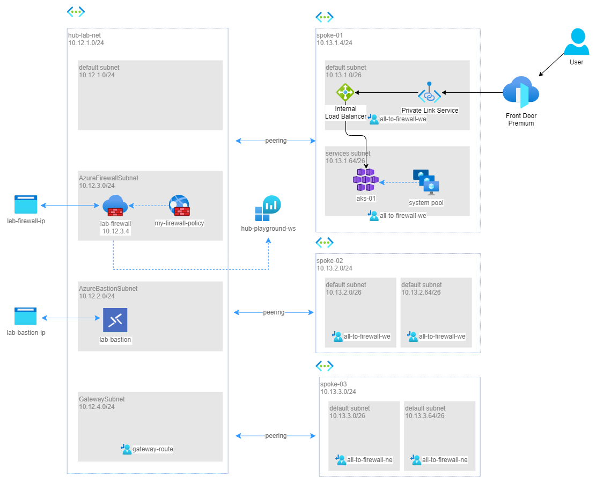
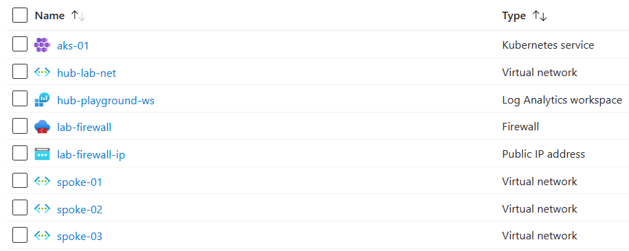
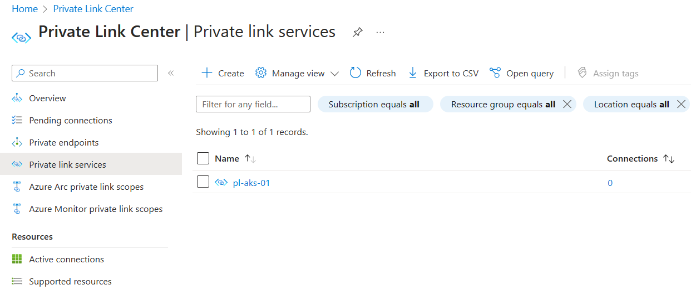
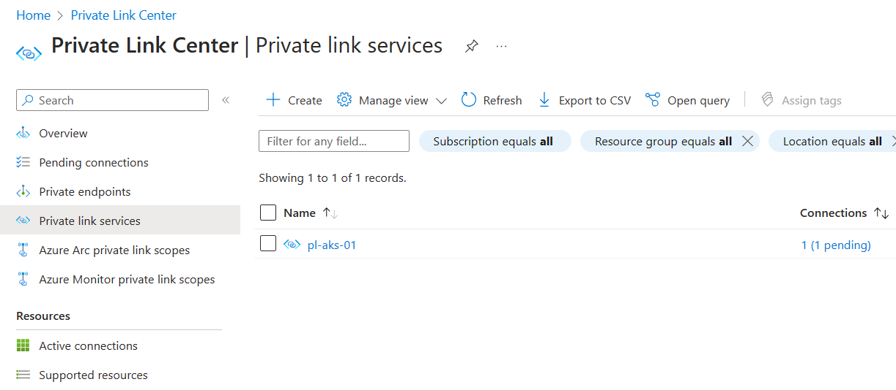
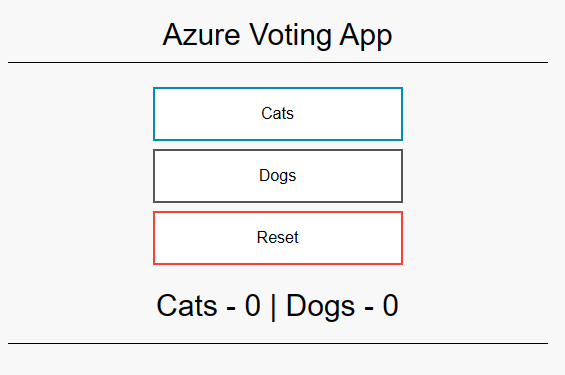

# SCENARIO: Deploy a Front Door to expose AKS workload

## Pre-requisites

To implement this scenario, you need 
* a resource group called `play-aks`
* a terminal shell with Azure CLI already connected to your subscription

## Architecture



## Solution

In this scenario, you'll use 2 .bicep files to deploy the components for the solutions, the [front-door-1.bicep](../front-door/front-door-1.bicep) will deploy the Hub & Spoke networks, the AKS cluster and the Private Link Service. Then the [front-door-2.bicep](../front-door/front-door-2.bicep) will deploy Front Door and connect it to the Private Link Service as an origin.
Therefore the only exposed endpoint is Front Door, then traffic flows privately using the Microsoft backbone up to the pod.

**Why I need 2 bicep files?**
As of now, the resource _privateLinkService_ does not support dependsOn property with the existing keyword. That's why we need to execute the 2 files sequentially.
Open a Terminal and execute the following command:

```
az deployment group create --resource-group play-aks --template-file front-door-1.bicep
```

You'll see the following resources provisioned to your resource group



As of now, you have an AKS cluster up and running with a deployment and a service exposed using a private load balancer.
You can use any VM in the HUB or in the spokes to communicate with the private IP exposed by the load balancer, but in this scenario we're willing to expose it to the Internet via Front Door.
To do it in a secure way, we'll leverage Front Door **Premium** feature that is Private Link origins. That's why we deployed, not only a Private Load Balancer, but a Private Link Service too, attached to the Load Balancer.
If you see the PLS that has been deployed, you'll see it has no connections yet.



As soon as we deploy the following .bicep, you'll see that there will be a new connection to that PLS, initiated by Front Door.
Open a Terminal and execute the following command:

```
az deployment group create --resource-group play-aks --template-file front-door-2.bicep
```
You'll now have a Front Door URL you can use to reach your pod. If you try to browse it, you'll surprisingly notice that you'll receive a Gateway Timeout Error (HTTP 502), why?
The reason is that, Front Door requested a new connection to your Private Link Service, but that request must be approved before the connection effectively starts.



This behaviour is required because Front Door is an Azure Managed Service, globally distributed and external to your tenant, so it is treated as an external entity who is requesting to access a link inside your tenant.
To approve the request, go to the Azure Portal -> Private Link Service. There you'll find the request to approve.


# Test scenario

Once approved, go to your Azure Front Door instance `aks-fd`, copy the endpoint hostname (something like `aks-afd-j6nwrw4dffkkq-e8hrbed2ere6gzb8.z01.azurefd.net`), open your local browser and paste the URL: You'll be able to reach you pod, **served by Front Door!** 🎉

